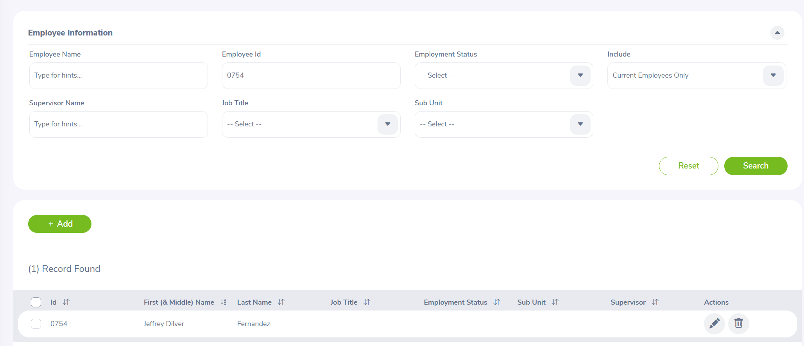
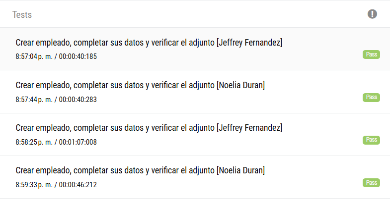

# UNIVERSIDAD CATÓLICA BOLIVIANA "SAN PABLO"

## Diplomado en Testing de Software V6
## Automatización I - Introducción a la automatización de pruebas: UnitTest/UI con Selenium

INTEGRANTES:
                — Noelia Paola Duran Llaveta
                — Jeffrey Dilver Fernandez Apaza

Proyecto de automatización de OrangeHRM: 

1.	Iniciar sesión en la aplicación.
2.	Ir al módulo PIM desde el menú.
3.	Crear un empleado nuevo con sus datos personales y sus datos de usuario.
4.	Buscar ese empleado en el listado de empleados.
5.	Verificar que aparece en la grilla de resultados.
6.  Actualizar PersonalDetails, Custom Fields, Attachments

## Estructura
Se implemento Page object Model y se tiene la siguiente estructura:
```text
ORANGE/
├── pom.xml
├── suite-regression.xml
├── resources/
│   └── testdata/
│       ├── employees.json
│       └── attachments/EmployeeScreen.txt
└── src/
    ├── main/
    │   ├── java/org/orangehrm/
    │      ├── helpers/       lectura JSON, screenshots y reporte
    │      ├── models/        EmployeeData
    │      └── pages/         locators y acciones de cada página
    └── test/java/
        ├── conf/BaseTest.java      ciclo de navegador y reporte
        └── employee/EmployeeWorkflowTest.java
```


## Flujo automatizado

El proyecto automatiza el registro de empleados en OrangeHRM con Selenium y Page Object Model. Para cada empleado y navegador, inicia sesión, entra a PIM, crea y busca al empleado por Employee Id, y completa sus datos personales, campos personalizados y adjunto.

Los datos de prueba, las credenciales del demo y la ruta del archivo se cargan desde employees.json. EmployeeScreen.txt es un archivo de ejemplo.

El nombre se mantiene como está en el JSON. El usuario se genera con el formato nombre.apellido; si ya existe, se intenta con un sufijo de dos dígitos. Los campos y opciones personalizados dependen de la configuración de OrangeHRM.

## Requisitos

- Java 21, Maven y Intellij IDEA . 
- Google Chrome y Mozilla Firefox.


## Resultados

Se visualiza algunas capturas realizadas del proyecto:

Busqueda y verificación del empleado.



Ejecución exitosa de la suite de regresioó en Chrome y Firefox.


Resultados de las pruebas de creación de empleados.

